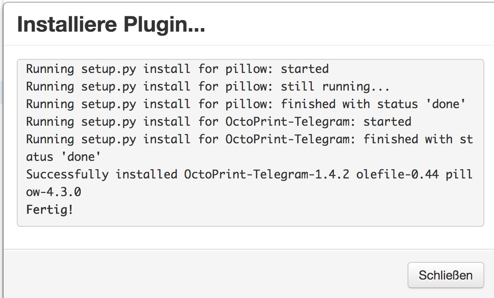
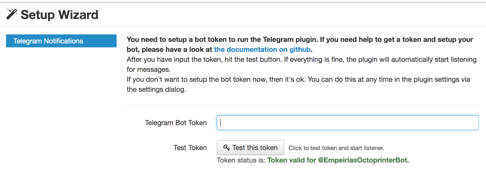
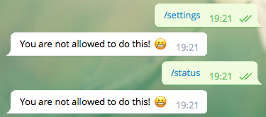
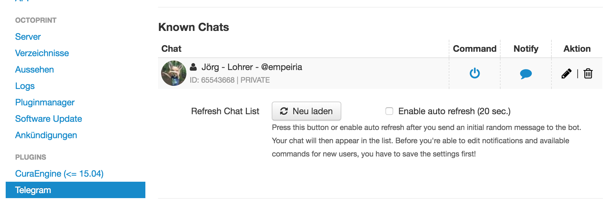

Das [OctoPrint-Telegram-Plugin](http://plugins.octoprint.org/plugins/telegram/) schafft eine Schnittstelle zwischen Telegram und OctoPrint.
Hier die Anleitung auf Englisch: [https://github.com/fabianonline/OctoPrint-Telegram/blob/stable/README.md](https://github.com/fabianonline/OctoPrint-Telegram/blob/stable/README.md)

Das dauert eine Weile:

Token eingeben:

Heisst aber nicht, dass jetzt alles gleich klappt:

Es müssen dem Benutzer noch die Rechte “Command” und “Notify” gegeben werden:
