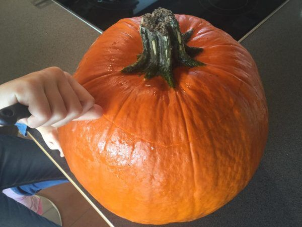
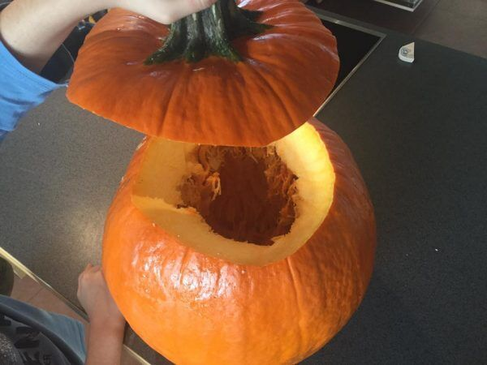
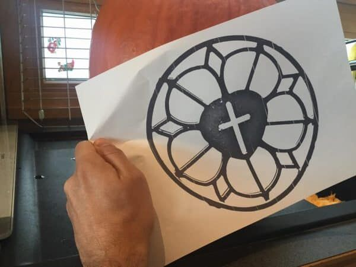
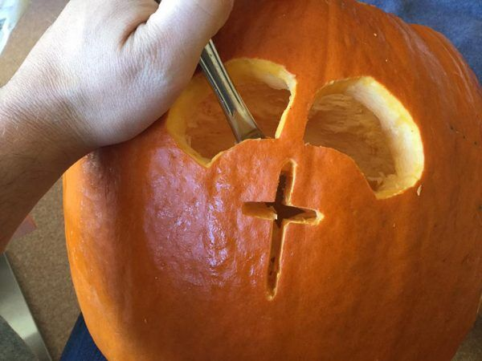

# Lutherkürbis - Reformation an Halloween

Das Symbol der Lutherrose ist auch heute noch in vielen Wappen enthalten und wird als Dekoelement genutzt ([Quelle: epd/imago](https://www.t-online.de/leben/familie/id_65982142/lutherrose-entstehung-und-bedeutung.html))

Aus einer [Fotovorlage der Lutherrose](https://duckduckgo.com/?q=lutherrose&t=h_&iax=images&ia=images) wird mit einem [Online-Konverter eine Schablone als verlustfrei skalierbare Vektorgrafik](https://image.online-convert.com/convert-to-svg) erzeugt:

[Lutherrose PDF-Vorlage](https://material.rpi-virtuell.de/wp-content/uploads/2018/10/Lutherrose.pdf)

## Bastel-Anleitung
Einen Kürbis aufschneiden:

entkernen und aushöhlen:

Schablone aufbringen:

Ausschneiden:

Mit Kerze oder elektrischem Licht ausstatten:

Fertig! 

Diese Idee inklusive der Schablone steht unter [CC0-Lizenz](https://creativecommons.org/publicdomain/zero/1.0/deed.de). Du darfst das Werk kopieren, verändern, verbreiten und aufführen, sogar zu kommerziellen Zwecken, ohne um weitere Erlaubnis bitten zu müssen.
#### Weitere Quellen
 * How to Make a Paper Cut-Out Luther Rose [YouTube](https://www.youtube.com/watch?v=b5FCaNZPU98) | [PDF](http://www.kellyklages.com/lutherrose.pdf)