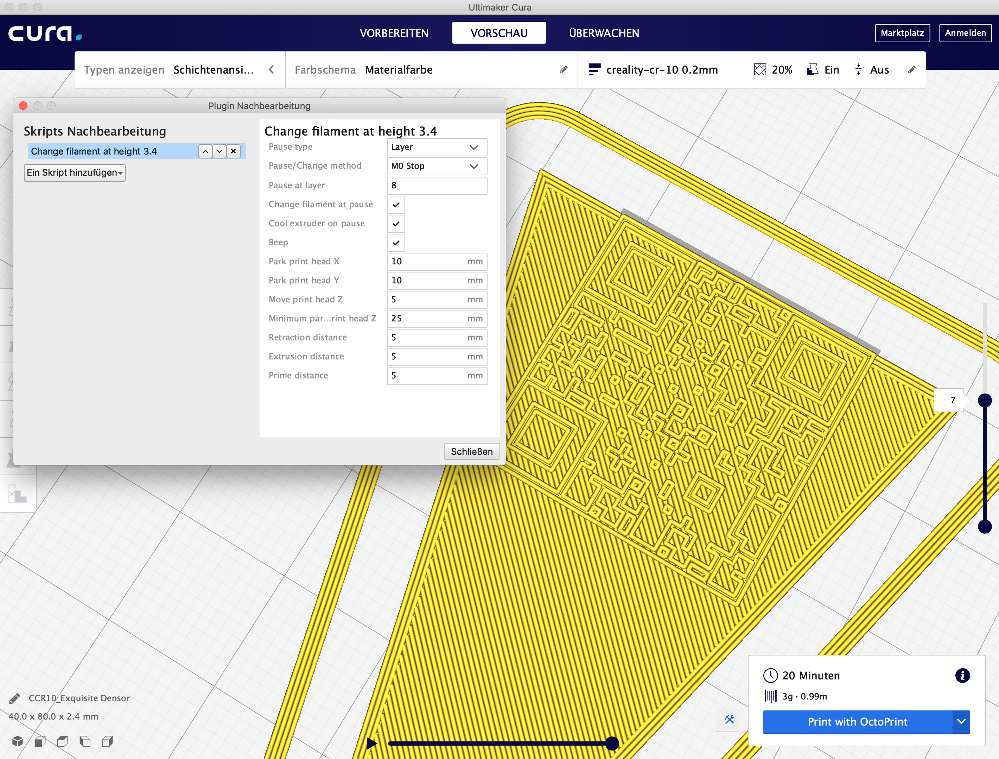
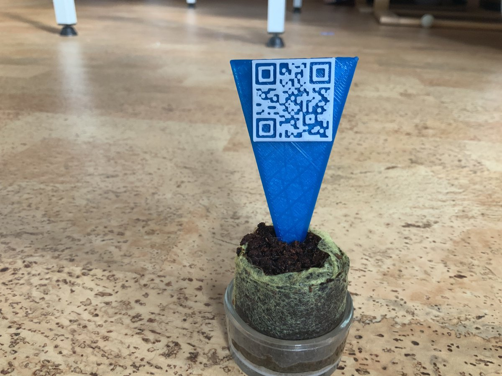

# Pflanzenschild mit QR-Code
Mit einem QR-Code-Generator lassen sich verlustfrei skalierbare Vektorgrafiken (SVG) erstellen:

Dann noch mit Thingiverse ein Dreieck designen (80x40x1.4mm) und den QR-Code obendrauf:

Mit dem Cura-Plugin [Change Filament at Z](https://www.thingiverse.com/thing:2077884/#files) den 3D-Druck im Layer unterbrechen, wo ein Filament(Farb)-Wechsel stattfinden soll:

Et voilà:

