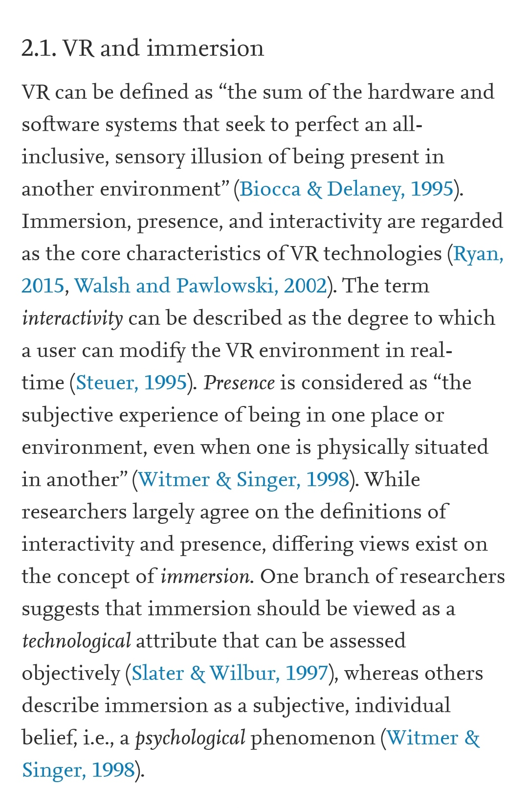
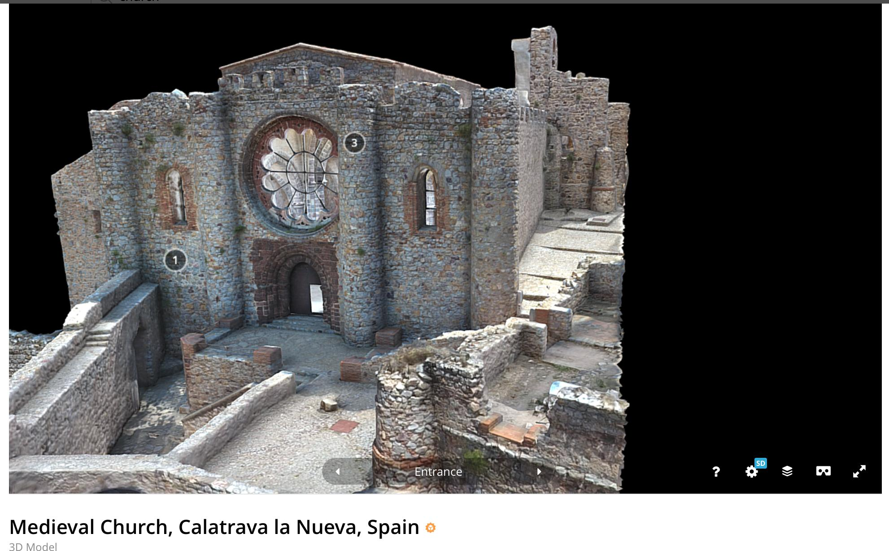
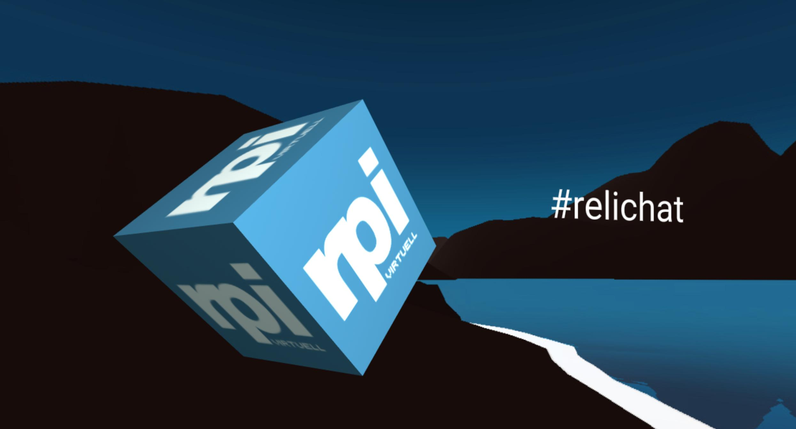
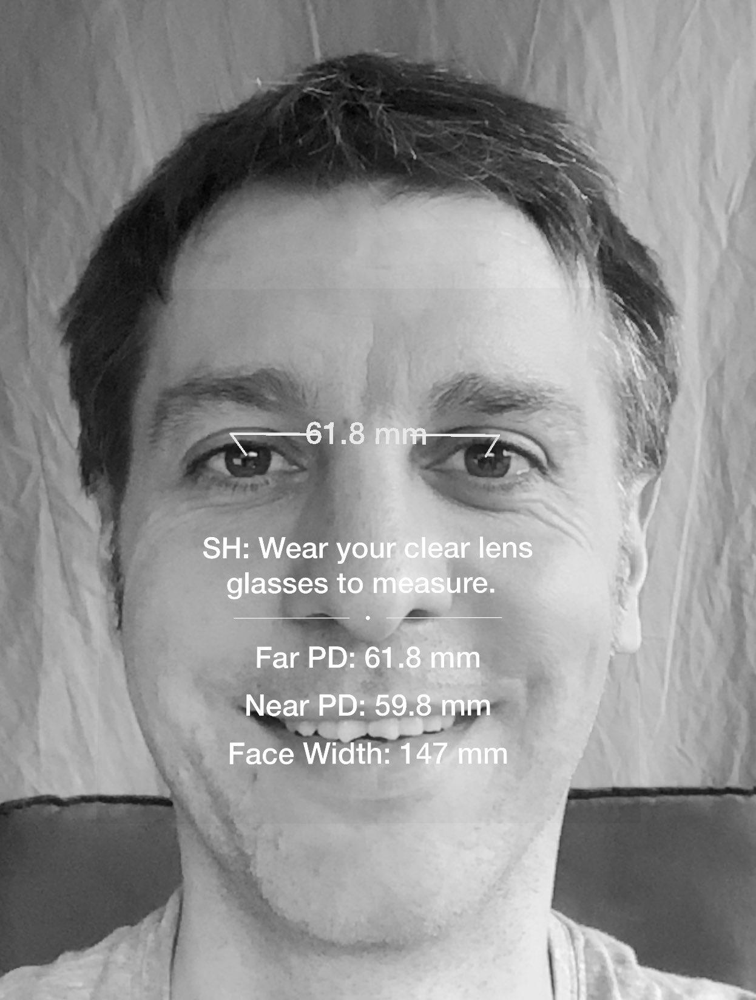
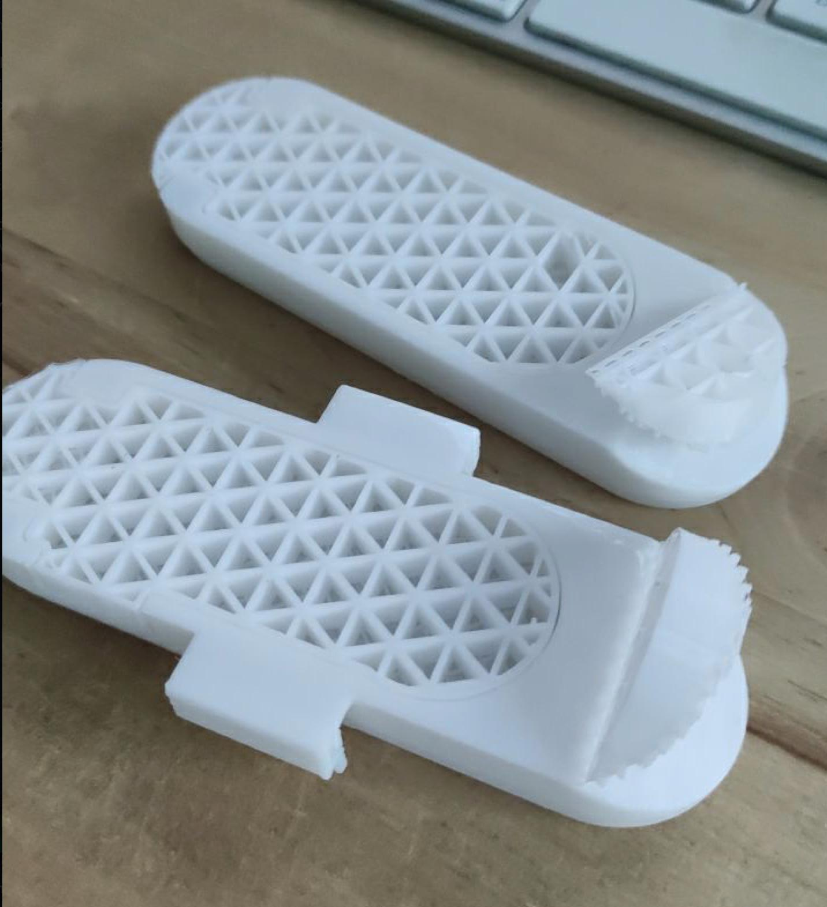
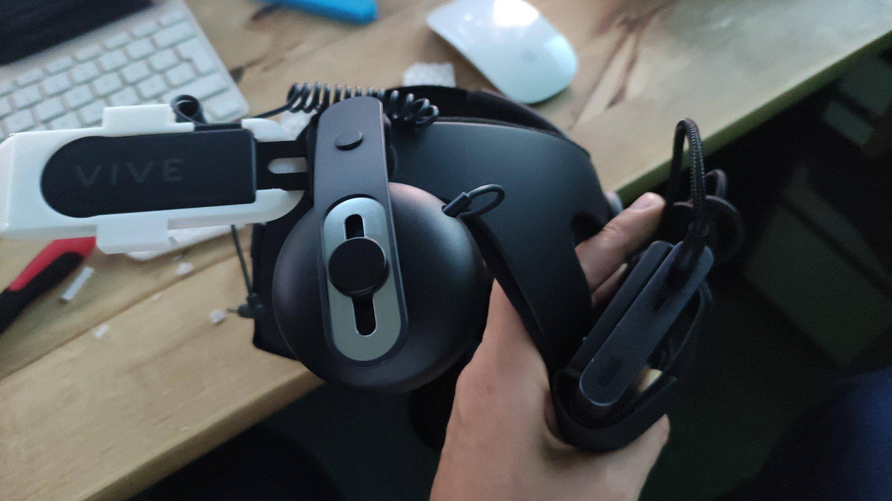

# VR - Virtual Reality

# Ausschreibung Torsten & Jörg

Ausgehend vom Lernbaustein [https://relilab.org/vr/](https://relilab.org/vr/) beschäftigen wir uns in diesem Workshop mit Immersion und praktischen Beispielen im Themenbereich VR/AR. Neben der Vermittlung von theoretischen Grundlagen besprechen wir die Einsatzmöglichkeit im Religionsunterricht am Beispiel einer Reihe zu Schöpfungsmythen. Darüber hinnaus bieten wir die Gelegenheit zu Erfahrungsaustausch, Diskussion und exemplarischen Erlebnismöglichkeiten in der virtuellen Realität. 

# Theorie
## Immersion & Präsenz
[https://www.immersivelearning.institute/](https://www.immersivelearning.institute/)
[https://omnia360.de/blog/was-ist-immersion/](https://omnia360.de/blog/was-ist-immersion/)
[https://en.wikipedia.org/wiki/Immersive_learning](https://en.wikipedia.org/wiki/Immersive_learning)

[https://www.sciencedirect.com/science/article/pii/S0360131519303276](https://www.sciencedirect.com/science/article/pii/S0360131519303276)
## Forschung
A Public Database of 360 Videos with Corresponding Ratings of Arousal and Valence
[https://vhil.stanford.edu/360-video-database/](https://vhil.stanford.edu/360-video-database/)

[https://www.researchgate.net/publication/335733502_Getting_your_game_on_Using_virtual_reality_to_improve_real_table_tennis_skills](https://www.researchgate.net/publication/335733502_Getting_your_game_on_Using_virtual_reality_to_improve_real_table_tennis_skills)
> "Diese Studie ergänzt die spärliche, aber wachsende Literatur, indem sie den Transfer von Fertigkeiten aus der realen Welt durch Virtual Reality in einer sportlichen Aufgabe demonstriert."

[https://mixed.de/vr-und-philosophie-youtuber-zeigt-ungewoehnliche-vr-apps/amp/](https://mixed.de/vr-und-philosophie-youtuber-zeigt-ungewoehnliche-vr-apps/amp/)
Der norwegische Forscher Joakim Vindenes unterhält einen Blog, Podcast und Youtube-Kanal, in denen er außergewöhnliche VR-Apps vorstellt und sich mit der philosophischen Dimension des Mediums auseinandersetzt.

[https://www.youtube.com/watch?v=VY5HaEhUm2Q](https://www.youtube.com/watch?v=VY5HaEhUm2Q)
A look at what it would be like to plug into an infinite VR experience machine. 

## Religionen
[https://www.matrise.no/2019/06/hinduism-and-virtual-reality/](https://www.matrise.no/2019/06/hinduism-and-virtual-reality/)

[https://www.matrise.no/2020/01/the-existential-problem-of-vr-existentialism/](https://www.matrise.no/2020/01/the-existential-problem-of-vr-existentialism/)

## Empathie
[https://www.youtube.com/watch?v=L6m79wqNiMA&feature=youtu.be&t=150](https://www.youtube.com/watch?v=L6m79wqNiMA&feature=youtu.be&t=150)
> "VR is a storytelling vehicle, but it's an empathy vehicle."

## Therapie
Feeling Good during the COVID19 Epidemic
Virtual Reality Can Help Us to Overcome the Psychological Burden of Coronavirus - [https://www.covidfeelgood.com/home](https://www.covidfeelgood.com/home)

Die Verkörperung von Mitgefühl in der virtuellen Realität und ihre Auswirkungen auf Patienten mit Depressionen
[https://scitec-media.ch/2016/03/04/game-technologien-helfen-gegen-depressionen/](https://scitec-media.ch/2016/03/04/game-technologien-helfen-gegen-depressionen/)
[https://www.youtube.com/watch?v=GwxJVCESc-E](https://www.youtube.com/watch?v=GwxJVCESc-E)
[https://www.cambridge.org/core/journals/bjpsych-open/article/embodying-selfcompassion-within-virtual-reality-and-its-effects-on-patients-with-depression/](https://www.cambridge.org/core/journals/bjpsych-open/article/embodying-selfcompassion-within-virtual-reality-and-its-effects-on-patients-with-depression/1A1217651159D085145A7999CFFFF772)

## Theater
[https://www.brendanabradley.com/futurestages](https://www.brendanabradley.com/futurestages)

## Körperlichkeit
[https://www.matrise.no/2018/07/virtual-embodiment/](https://www.matrise.no/2018/07/virtual-embodiment/)
[https://www.matrise.no/2020/10/virtual-reality-depersonalization-derealization/](https://www.matrise.no/2020/10/virtual-reality-depersonalization-derealization/)

# Praxis
## Padlets
- [https://padlet.com/petiteprof79/xrinfo(https://padlet.com/petiteprof79/xrinfo)] XR-Info - Stephanie Wössner | CC BY-SA @petiteprof79
- [https://padlet.com/strsa/ar](https://padlet.com/strsa/ar) Augmented Reality (AR) & 360°, (VR) | Gestartet von Tobias Erles (@Mr_Airless) und Sabine Strauss (@Sallythechin) beim Barcamp #wildcampen18, erweitert bei #wildcampen19 zusammen mit Jan Hartwig (@hartifical)
## Artikel
- [Virtual und Augmented Reality im Klassenraum? Ein Überblick bildungsrelevanter Angebote - Steffen Jauch am 16.10.2029 bei bpb](https://www.bpb.de/lernen/digitale-bildung/werkstatt/298516/virtual-und-augmented-reality-im-klassenraum-ein-ueberblick-bildungsrelevanter-angebote)

## Unterricht
- Eine [Auswahl an Unterrichtsbeispielen mit Virtual Reality Szenarien](https://www.lmz-bw.de/medien-und-bildung/medienwissen/virtual-und-augmented-reality/virtual-reality-unterrichtsbeispiele/) von Stephanie Wössner [@petiteprof79](https://twitter.com/petiteprof79)

## Communities
[https://educatorsinvr.com/](https://educatorsinvr.com/)

# Religiöse Erfahrungsräume
## im Oculus Store
### Wander
[https://www.oculus.com/experiences/quest/2078376005587859/](https://www.oculus.com/experiences/quest/2078376005587859/)

## Filme
[https://mixed.de/beruehrender-oculus-film-zeigt-worauf-es-im-leben-ankommt/(https://mixed.de/beruehrender-oculus-film-zeigt-worauf-es-im-leben-ankommt/)]

## In Sidequest

### Vanishing Grace
[https://sidequestvr.com/app/772/vanishing-grace-pre-alpha-demo(https://sidequestvr.com/app/772/vanishing-grace-pre-alpha-demo)]
> Vanishing Grace ist eine emotionale Reise über die Opfer, die wir bringen müssen, um unseren Platz in der Welt einzunehmen.
### Cubism
[https://sidequestvr.com/app/403/cubism-demo(https://sidequestvr.com/app/403/cubism-demo)]

### Deism
> The virtual reality god simulator
[https://sidequestvr.com/app/85/deisim(https://sidequestvr.com/app/85/deisim)]

### Liminal
[https://sidequestvr.com/app/1042/liminal](https://sidequestvr.com/app/1042/liminal)
Wählen Sie aus, wie Sie sich fühlen und was Sie leisten wollen: Ruhe, Energie, Schmerzlinderung und Ehrfurcht.

# 3D-Modelle
[https://sketchfab.com/3d-models/abandoned-warehouse-interior-scene-1d5285f2e0fd4211a27c8042496d5959#](https://sketchfab.com/3d-models/abandoned-warehouse-interior-scene-1d5285f2e0fd4211a27c8042496d5959#)

[CC BY-NC](https://creativecommons.org/licenses/by-nc/4.0/) Medieval Church, Calatrava la Nueva, Spain
Processed in Reality Capture from 76 Faro laser scans and 4100 photographs
[https://sketchfab.com/3d-models/medieval-church-calatrava-la-nueva-spain-171a047c08bc4dd588cca5ac744e8065](https://sketchfab.com/3d-models/medieval-church-calatrava-la-nueva-spain-171a047c08bc4dd588cca5ac744e8065)

## Avatare

## Erfahrungswelten:

### 360 Grad Filme
 - [Kölner Dom in 360°: Privatkonzert | WDR](https://www.youtube.com/watch?v=dMZfIUr0gEs)
Der Domchor gibt ein nächtliches Konzert – und der einzige Zuschauer bist du. Unter Leitung des Domkapellmeisters Professor Eberhard Metternich singt der Chor das Ave Maria von Franz Biebl in einer eher ungewöhnlichen Aufstellung. Und du stehst mittendrin. [https://dom360.wdr.de/privatkonzert-bei-nacht/](https://dom360.wdr.de/privatkonzert-bei-nacht/)]
 - [INSIDE AUSCHWITZ - Das ehemalige Konzentrationslager in 360° | WDR
](https://www.youtube.com/watch?v=QwC5d75iTcA)

### Anne Frank VR
[https://www.annefrank.org/](https://www.annefrank.org/de/uber-uns/was-wir-tun/unsere-publikationen/das-anne-frank-haus-virtual-reality/)

### Within
[https://www.with.in/watch/the-ellen-fund-presents-gorillas-in-vr(https://www.with.in/watch/the-ellen-fund-presents-gorillas-in-vr)]
[https://account.altvr.com/channels/VRChurch(https://account.altvr.com/channels/VRChurch)]

# Programmierung
* [Learn VR Development: Tips, tricks, and guides to develop VR and AR applications](https://circuitstream.com/blog/programming-development-guides/)
* [Reddit - Learn Virtual Reality Development](https://www.reddit.com/r/learnVRdev/)

## Mozilla Hubs
### Dokumentation [https://hubs.mozilla.com/docs/welcome.html(https://hubs.mozilla.com/docs/welcome.html)]

### Vorlagen

[https://v3l.de/relilabvr](https://v3l.de/relilabvr) (relilab-VR-Hub mit Videos, Bildern, ...)

[https://hubs.mozilla.com/Av38AUU/detailed-tinted-room(https://hubs.mozilla.com/Av38AUU/detailed-tinted-room)]
[https://hubs.mozilla.com/scenes/juMbRem/dramainvrhome(https://hubs.mozilla.com/scenes/juMbRem/dramainvrhome)]

### Avatare erstellen

### Mozilla Hubs - GLB
#### Online Dienst - Readyplayer
[https://twitter.com/joerglohrer/status/1388023150626099201](https://twitter.com/joerglohrer/status/1388023150626099201)

[https://readyplayer.me/(https://readyplayer.me/)]

Beispiel: ([CC BY-NC-SA - Wolfprint 3D](https://creativecommons.org/licenses/by-nc-sa/4.0/))
[https://d1a370nemizbjq.cloudfront.net/10b05c49-593a-4616-82e9-adcea09aa66c.glb](https://d1a370nemizbjq.cloudfront.net/10b05c49-593a-4616-82e9-adcea09aa66c.glb)

Hubs by Mozilla
* [Creating Custom Avatars](https://hubs.mozilla.com/docs/intro-avatars.html)
* [Advanced Avatar Customization](https://hubs.mozilla.com/docs/creators-advanced-avatar-customization.html)

[http://tryquilt.io/](http://tryquilt.io/)]

[Blender files for AvatarBot](https://github.com/MozillaReality/hubs-avatar-pipelines/tree/master/Blender/AvatarBot)
[Creating an Avatar using Hubs components in Blender](https://youtube.com/playlist?list=PLCxaiaRxTL6-3pxUsfSa7lzKruGu5UEat)

#### Online Editoren
[https://modelviewer.dev/editor/(https://modelviewer.dev/editor/)]

#### Software
##### MakeHuman
[http://makehumancommunity.org/](http://makehumancommunity.org/)

[https://www.youtube.com/watch?v=kQjp5DYsR_c&t=86s](https://www.youtube.com/watch?v=kQjp5DYsR_c&t=86s)

### Tutorials Altspace / Blender / Unity
[http://edvschwab.de/Altspace/Kurz%20Doku%20Blender.pdf](http://edvschwab.de/Altspace/Kurz%20Doku%20Blender.pdf)
[http://edvschwab.de/Altspace/Kurz%20Doku%20Unity.pdf(http://edvschwab.de/Altspace/Kurz%20Doku%20Unity.pdf)]

## Sidequest
[https://sidequestvr.com/](https://sidequestvr.com/)
Installation:
[https://sidequestvr.com/setup-howto](https://sidequestvr.com/setup-howto)

[How to put custom songs onto Beat Saber on Oculus Quest](https://www.google.com/amp/s/www.androidcentral.com/how-put-custom-songs-beat-saber-oculus-quest%3famp)

## Aframe

[https://codepen.io/joerglohrer/full/dyXQqWG](https://codepen.io/joerglohrer/full/dyXQqWG)
[https://aframe.io/](https://aframe.io/)
[https://www.codecademy.com/learn/learn-a-frame](https://www.codecademy.com/learn/learn-a-frame)
VR development within VR with Oculus Quest + Firefox Reality + Glitch + 
[https://rocketvirtual.com/index.html](https://rocketvirtual.com/index.html)
[Where to begin with VR in a browser?](https://michael-mcanally.medium.com/where-to-begin-with-vr-in-a-browser-d818f713a8a8)
[https://www.reddit.com/r/WebVR/comments/equgdt/vr_development_within_vr_with_oculus_quest/](https://www.reddit.com/r/WebVR/comments/equgdt/vr_development_within_vr_with_oculus_quest/)

[https://aframe-model-viewer.glitch.me/](https://aframe-model-viewer.glitch.me/)

[https://klausw.github.io/a-frame-car-sample/index.html](https://klausw.github.io/a-frame-car-sample/index.html)

## ThreeJS
[https://threejs.org/](https://threejs.org/)
[https://www.jesuisundev.com/en/understand-threejs/](https://www.jesuisundev.com/en/understand-threejs/)

## ~~Tour Creator Google~~
"Starting June 30, 2021, the Google Expeditions and Tour Creator [will no longer be accessible](https://support.google.com/tourcreator/?hl=en)."

## Unity
[https://unity.com/de/learn/get-started](https://unity.com/de/learn/get-started)

# Optik
## Pupillendistanz (PD) messen - IPD (interpupillary distance)
[https://apps.apple.com/de/app/eyemeasure/id1417435049](https://apps.apple.com/de/app/eyemeasure/id1417435049)
Die kostenfreie App misst den Augenabstand auf 0,5 mm genau ab iPhoneX oder iPadPro

Oder einfach mit Lineal:
[https://imgur.com/a/gyYKB](https://imgur.com/a/gyYKB)

# Oculus Quest
## Tutorials
### Deutsch
[https://twitter.com/StubeDie](https://twitter.com/StubeDie)
### Englisch
#### Foren
[https://www.reddit.com/r/OculusQuest/](https://www.reddit.com/r/OculusQuest/)
[https://www.reddit.com/r/OculusQuest2/](https://www.reddit.com/r/OculusQuest2/)

## Streaming / Playthrough / Livecasting / OBS
[Oculus Quest Recording / Live Streaming Guide](https://bsaber.com/queststreamingguide/)
[How to stream on Twitch: the ultimate guide](https://restream.io/blog/ultimate-guide-to-twitch/)

## File Transfer
3 different ways
https://www.youtube.com/watch?v=APbbuJF4Ma4
https://www.android.com/filetransfer/
[Wie übertrage ich Bilder oder Videos von meinem Computer auf mein Oculus Quest 2 oder Quest?](https://support.oculus.com/2255729571307786/)

Facebook video downloader here - https://fbdown.net/

## Brillenträger
Sehstärke-Linsen Einsätze
https://mixed.de/vr-optiker-sehstaerke-linsen-test/
- https://vroptiker.de/sehstaerke-linsen-einsaetze/oculus-quest2/
- https://widmovr.com/product/oculus-quest-2-prescription-lens-adapters/

## Not to do
### Sonnenlicht in die Linse)
Sonnenlicht kann durch die Linsen gebündelt werden und das Display beschödigen.
### Linsen reinigen
### Grips - Handhalterungen
[https://www.youtube.com/watch?v=_52xWr_R4uM&feature=youtu.be&t=388](https://www.youtube.com/watch?v=_52xWr_R4uM&feature=youtu.be&t=388)

### Headstrap
#### VIVE DELUXE AUDIO STRAP
[https://www.vive.com/de/accessory/vive-deluxe-audio-strap/](https://www.vive.com/de/accessory/vive-deluxe-audio-strap/)

FrankenQuest 2 
[https://uploadvr.com/frankenquest-2-quest-2/](https://uploadvr.com/frankenquest-2-quest-2/)
Adapter zum 3D-Druck:
[https://www.thingiverse.com/thing:4622970](https://www.thingiverse.com/thing:4622970)
Variante mit Kabelklemme (oben oder unten):
[https://www.thingiverse.com/thing:4628600/files](https://www.thingiverse.com/thing:4628600/files)

:::success
Druck skaliert auf 101% 
:::
Install guide
Remove the Quest 2 straps following this guide: [https://www.youtube.com/watch?v=PejiYjR7_44&feature=youtu.be&t=110](https://www.youtube.com/watch?v=PejiYjR7_44&feature=youtu.be&t=110)
Snap the DAS onto the adaptor (pushing the round front section in first like in the picture).
Snap the adaptor onto Quest 2.
Use the velcro loop to attach the head strap to the headset.

Oculus Quest 2 Comfort Head Strap Mods! 

#### 3DDruck
Oculus Quest 2 Elite Strap_V2_NAVIDA DESIGN
[https://www.thingiverse.com/thing:4630780/files(https://www.thingiverse.com/thing:4630780/files)]
Oculus Link Cable Clip for Deluxe Audio Strap "DAS"
[https://www.thingiverse.com/thing:4666749](https://www.thingiverse.com/thing:4666749)

Überblick:
[https://www.youtube.com/watch?v=sUhMk19PVq4](https://www.youtube.com/watch?v=sUhMk19PVq4)
[https://www.youtube.com/watch?v=CN9fYlUGVtk](https://www.youtube.com/watch?v=CN9fYlUGVtk)

### Lens Adaptor
#### Für Brillen
[https://www.thingiverse.com/thing:3653631(https://www.thingiverse.com/thing:3653631)]
Für Linsen
[https://www.thingiverse.com/thing:3642004(https://www.thingiverse.com/thing:3642004)]

Esimen Upgrade K3

### Batterie
[https://www.androidcentral.com/best-oculus-quest-battery-pack](https://www.androidcentral.com/best-oculus-quest-battery-pack)
