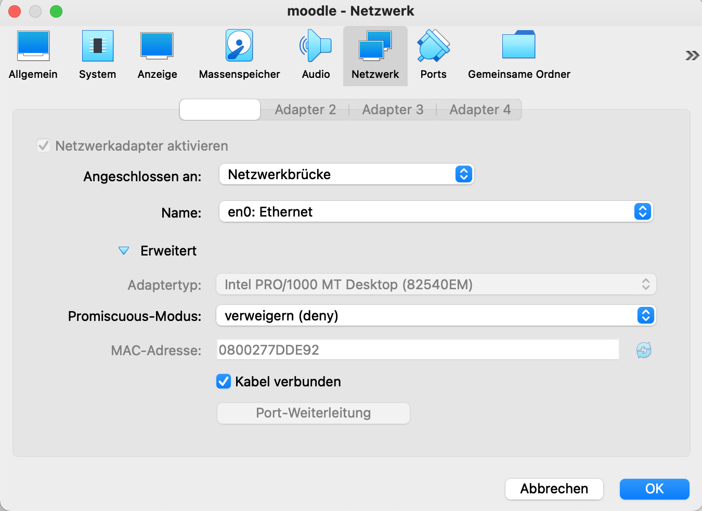

# Moodle Server mit Ubuntu 20 LTS und Iomad

## Ubuntu Server-Image herunterladen
[https://releases.ubuntu.com/20.04/](https://releases.ubuntu.com/20.04/)

## Virtualbox mit dem Ubuntu Image einrichten
### Netzwerkbrücke aktivieren


### IP-Adresse ermitteln
```ifconfig ``` -> 192.168.178.132

### Auf dem Mac (oder PC) die Auflösung des Hosts verknüpfen
auf dem Mac ```sudo nano /etc/hosts``` die IP eintragen und moodle.local zuweisen: 


## Moodle Server auf Virtualbox vorbereiten
```sudo -i```wechselt auf root

### SSH Zugriff ermöglichen
[Allow SSH root login on Ubuntu 20.04 Focal Fossa Linux](https://linuxconfig.org/allow-ssh-root-login-on-ubuntu-20-04-focal-fossa-linux)

### Shellbefehle zur Installation:

```shell=
sudo apt update && apt upgrade -y

apt install mariadb-server
sudo apt install apache2 libapache2-mod-fcgid
sudo apt install php php-cli php-fpm php-json php-common php-mysql php-zip php-gd php-mbstring php-curl php-xml php-pear php-bcmath php-intl php-xmlrpc php-soap
a2enconf php7.4-fpm

sudo a2enmod actions fcgid alias proxy_fcgi setenvif

a2dismod php7.4
a2dismod mpm_prefork
a2dismod mpm_worker

a2enmod mpm_event

systemctl restart php7.4-fpm apache2
```

### anlegen: /etc/apache2/sites-available/moodle.conf 

```shell=
############################
<VirtualHost *:80>
	ServerName moodle.local

	ServerAdmin webmaster@localhost
	DocumentRoot /var/www/moodle
	
	<FilesMatch \.php$>
        SetHandler "proxy:unix:/var/run/php/php7.4-fpm.sock|fcgi://localhost/"
    </FilesMatch>
	
	ErrorLog ${APACHE_LOG_DIR}/error.log
	CustomLog ${APACHE_LOG_DIR}/access.log combined

</VirtualHost>
####################################################################
```
### Weitere Shellbefehle zur Installation:
```shell=
a2ensite moodle.conf
systemctl reload apache2

mkdir /var/www/moodle
echo '<?php phpinfo(); ?>' > /var/www/moodle/info.php 
````


### host eintrag hinzufügen: "192.168.178.xxx moodle.local"
   192.168.178.xxx  moodle.local 
   192.168.178.xxx  www.moodle.local 
### im Browser öffnen: http://moodle.local/info.php
### maschine speichern und klonen

## Anschließend IOMAD moodle installieren:
https://www.iomad.org/wp-content/uploads/2021/03/Iomad-Installation-Guide.pdf


### Datenbank für moodle erzeugen via SSH:

```shell=

mysql

CREATE DATABASE moodledb;
CREATE USER 'moodleowner'@'localhost' IDENTIFIED BY '$mdb2passwd';
GRANT SELECT, INSERT, UPDATE, DELETE, CREATE, INDEX, DROP, ALTER, CREATE TEMPORARY TABLES, LOCK TABLES ON moodledb.* TO 'moodleowner'@'localhost';
GRANT FILE ON *.* TO 'moodleowner'@'localhost';

quit
```


### Installation iomad

```shell=
cd /var/www/moodle
git clone https://github.com/iomad/iomad.git
cd iomad
git checkout -b myiomad origin/IOMAD_310_STABLE
mkdir /var/www/moodledata &&  chmod 777 /var/www/moodledata
```
**ändern!!!**: ```/etc/apache2/sites-available/moodle.conf  -> DocumentRoot /var/www/moodle/iomad```

```systemctl restart php7.4-fpm apache2```

###  http://moodle.local aufrufen und config.php Datei mit Hilfe des Assistenten generieren lassen


**ändern!!!**: ```/moodle``` entfernen

### config.php

```shell=
<?php  // Moodle configuration file

unset($CFG);
global $CFG;
$CFG = new stdClass();

$CFG->dbtype    = 'mariadb';
$CFG->dblibrary = 'native';
$CFG->dbhost    = 'localhost';
$CFG->dbname    = 'moodledb';
$CFG->dbuser    = 'moodleowner';
$CFG->dbpass    = '$mdb2passwd';
$CFG->prefix    = 'mdl_';
$CFG->dboptions = array (
  'dbpersist' => 0,
  'dbport' => '',
  'dbsocket' => '',
  'dbcollation' => 'utf8mb4_general_ci',
);

$CFG->wwwroot   = 'http://moodle.local';
$CFG->dataroot  = '/var/www/moodledata';
$CFG->admin     = 'admin';

$CFG->directorypermissions = 0777;

require_once(__DIR__ . '/lib/setup.php');

// There is no php closing tag in this file,
// it is intentional because it prevents trailing whitespace problems!
```