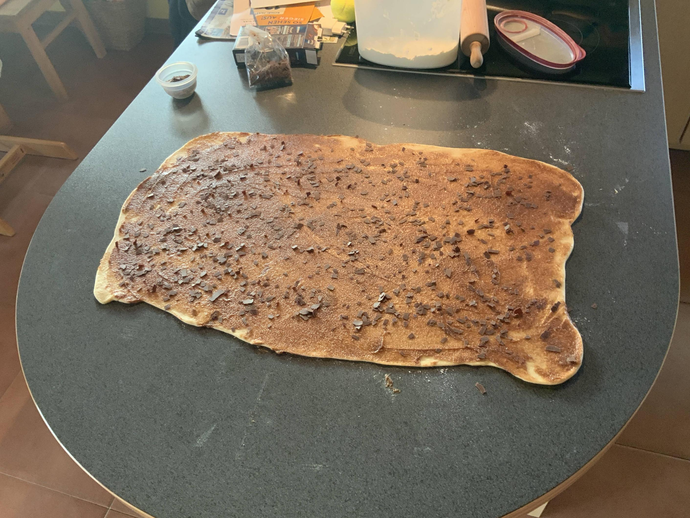

# Schoko-Schnecken

## Hefeteig
**200g Milch** handwarm
**½ Pk Vanillezucker
60g Zucker
22g Hefe**
verrühren
**1 Ei Größe L** dazu
in der Teigknetmaschine
**120g Weizenmehl 405
380g Dinkelmehl 630**
dazu und wenn es ein fester Teig ist
**5g Salz** zugeben
und
**60g Butter** kalt in Streifen schneiden und
5-10 Minuten einketen (-> Fenstertest)
danach Teig 30-60 Minuten ruhen/gehen lassen

## Füllung
in der Zwischenzeit
**10g brauner Zucker
30g Rohrohrzucker
50g weißer Zucker
100g Butter
½ Pk Vanillezucker
2 Teelöffel Zimt
5 Teelöffel Kaba**
verkneten zu einer cremigen Masse

Hefeteig ausrollen und mit der Füllung bestreichen
Nach Belieben noch **Raspel Schokolade** darauf verteilen 

einrollen, in 16 Stücke schneiden und in Kuchenform setzen:

Mit Frischhaltefolie abdecken und weitere ca. 30 Minuten gehen lassen, dann mit Eimilch abstreichen:

Backofen auf 220°Celsius Ober-/Unterhitze vorheizen.
In den Ofen und dabei auf 180° reduzieren.
Nach 10 Minuten auf 160° reduzien:

weitere 25 Minuten backen oder bis eine Kerntemperatur von 92° erreicht ist. Fertig:
