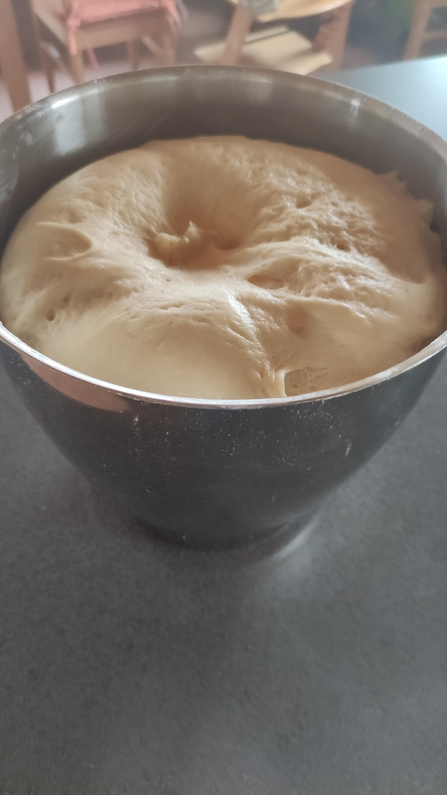
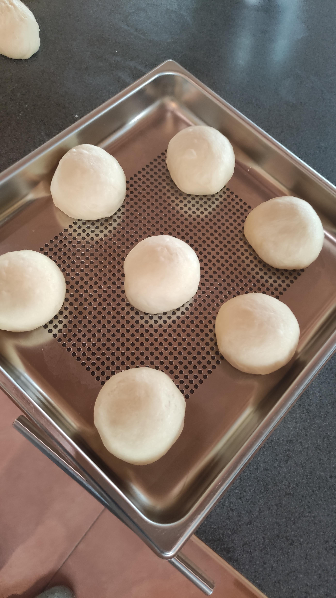
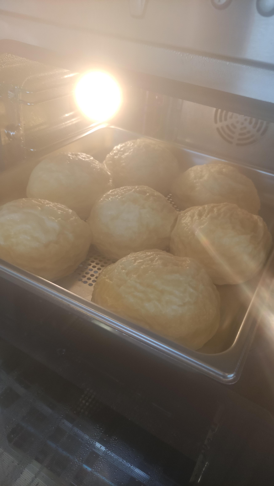
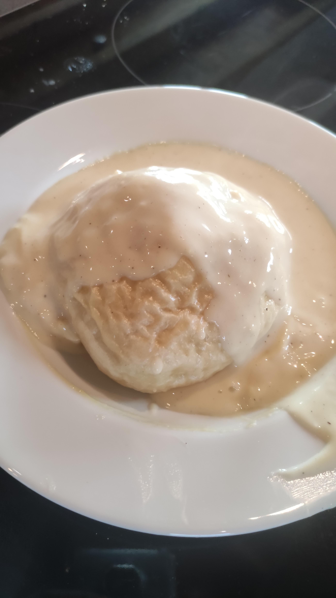
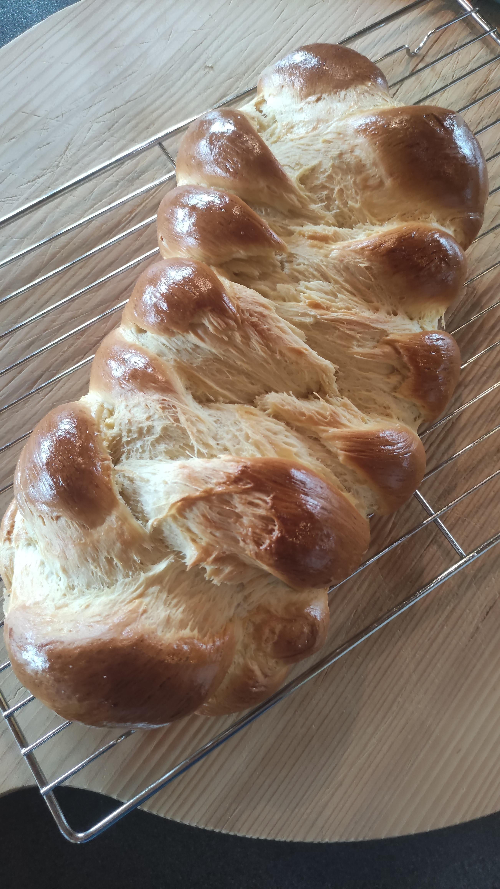

# Dampfnudeln & Minihefezopf

## Zutaten

- 400 ml Milch
- 120g Zucker
- 1 Pkg Hefe (42g)
- 3 Eier (ca 150g Vollei)
- 1000g Mehl (300g Weizen Type 405 & 700g Dinkel Type 630)
- 10 g Salz
- 120 g Butter

## Rezept
- Milch, Zucker, Hefe handwarm mischen
- Eier dazu und in der Knetmaschine 5 Minuten lang das Mehl unterkneten
- Salz dazu und die in Streifen geschnittene Butter weitere 10 Minuten verkneten
- Mindestens 30 Minuten gehen lassen

### Dampfnudeln
- 6 x 135g Stücke vom Teig abstechen, rundschleifen und auf gelochtes Dampfgarblech aufsetzen:

- weitere 30 Minuten gehen lassen
- dann bei 100°Celsius für 30 Minuten dampfgaren
- fertig
 
- mit Vanillesoße servieren 

### Hefezopf
- Die restlichen ca 900-1000g Teig in 3 gleiche Teile abwiegen und zu einem Zopf flechten
- Mit Küchenhandtuch abgedeckt mindestens 30 Minuten gehen lassen
- Mit Ei abstreichen und im auf 220° vorgeheizten Backofen direkt bei einschießen auf 180° reduzieren
- Nach 10 Minuten Back-Temperatur auf 160° reduzieren
- Entweder backen bis 93° Kerntemperatur erreicht ist oder nach ca weiteren 30 Minuten 

