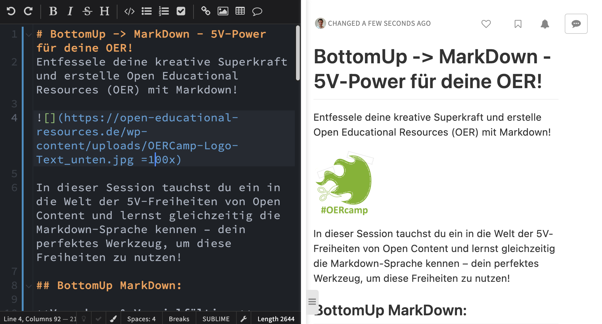

## Eine Session-Idee auf dem #OERcamp 24 in Hamburg
Entfessele deine kreative Superkraft und erstelle Open Educational Resources (OER) mit Markdown!

In dieser Session tauchst du ein in die Welt der 5V-Freiheiten von Open Content und lernst gleichzeitig die Markdown-Sprache kennen – dein perfektes Werkzeug, um diese Freiheiten zu nutzen!

## BottomUp MarkDown:

* **Verwahren & Vervielfältigen**: Gestalte direkt online ohne Software, Registrierungen oder Anmeldungen. Lade deine OER herunter, sichere sie und erstelle so viele Kopien, wie du benötigst – ganz ohne Limits! Mit Markdown speicherst du deine Inhalte im praktischen und leicht editierbaren Textformat.
* **Verwenden**: Ob im Unterricht, in Lerngruppen oder online – bringe deine OER in allen erdenklichen Kontexten zum Einsatz! Markdown macht deine Inhalte überall zugänglich und flexibel. Auch Vorlagen von Lehrenden, die Lernende übernehmen und anpassen können sind einfach bereitgestellt.
* **Verarbeiten**: Bearbeite deine Inhalte, passe sie an deine Bedürfnisse an und kreiere neue Lernmaterialien – deiner Fantasie sind keine Grenzen gesetzt! Markdown bietet dir die Freiheit, deine OER ständig weiterzuentwickeln, zu versionieren und zu verändern.
* **Vermischen**: Kombiniere deine OER mit anderen offenen Inhalten, erweitere sie mit Bildern, Videos und Musik (sogar urheberrechtlich geschützten Werken) und schaffe einzigartige Lernerlebnisse! Markdown lässt sich nahtlos mit anderen Formaten und Medien kombinieren.
* **Verbreiten**: Teile deine OER mit der Welt! Veröffentliche sie online, versende sie an Freunde und Kollegen und trage zur globalen Wissensgemeinschaft bei! Mit Markdown präsentierst du deine OER im Web in einem ansprechenden und nutzerfreundlichen Format, das barrierefrei weiternutzbar ist unanbhängig von technischer Infrastruktur oder Plattformen. 

### In dieser Session:

* **Entfessele die Markdown-Mania**: Lerne die Syntax der Sprache kennen und erstelle im Handumdrehen deine ersten OER.
* **Gestalte deine Inhalte mit Superkräften**: Formatiere Texte, füge Bilder und Tabellen ein und erstelle interaktive Elemente. Markdown gibt dir alle Werkzeuge dafür an die Hand.
* **Veröffentliche deine OER im Internet**: Erfahre, wie du deine Materialien online zugänglich machst und mit anderen teilst. Mit Markdown ist die Veröffentlichung deiner OER ein Kinderspiel.
* **Werde Teil der OER-Community**: Vernetze dich mit anderen Lernenden und Lehrenden und profitiere vom Austausch in der Community. Gemeinsam gestalten wir die Zukunft des Lernens mit Markdown!

## Austausch und Diskussion zu diesem Beitrag
- offen und dezentral 
    - **[hier auf Mastodon im Fediverse](https://reliverse.social/@joerglohrer/112044212054942606)**
- geschlossen und plattformgebunden
    - [hier auf bluesky](https://bsky.app/profile/joerglohrer.bsky.social/post/3kmxobg2grq22)
    - [hier in Threads](https://www.threads.net/@joerglohrer/post/C4JAGtZMLg8)
    - [hier in Linkedin](https://linkedin.com/feed/update/urn:li:activity:7170830032897056768/)