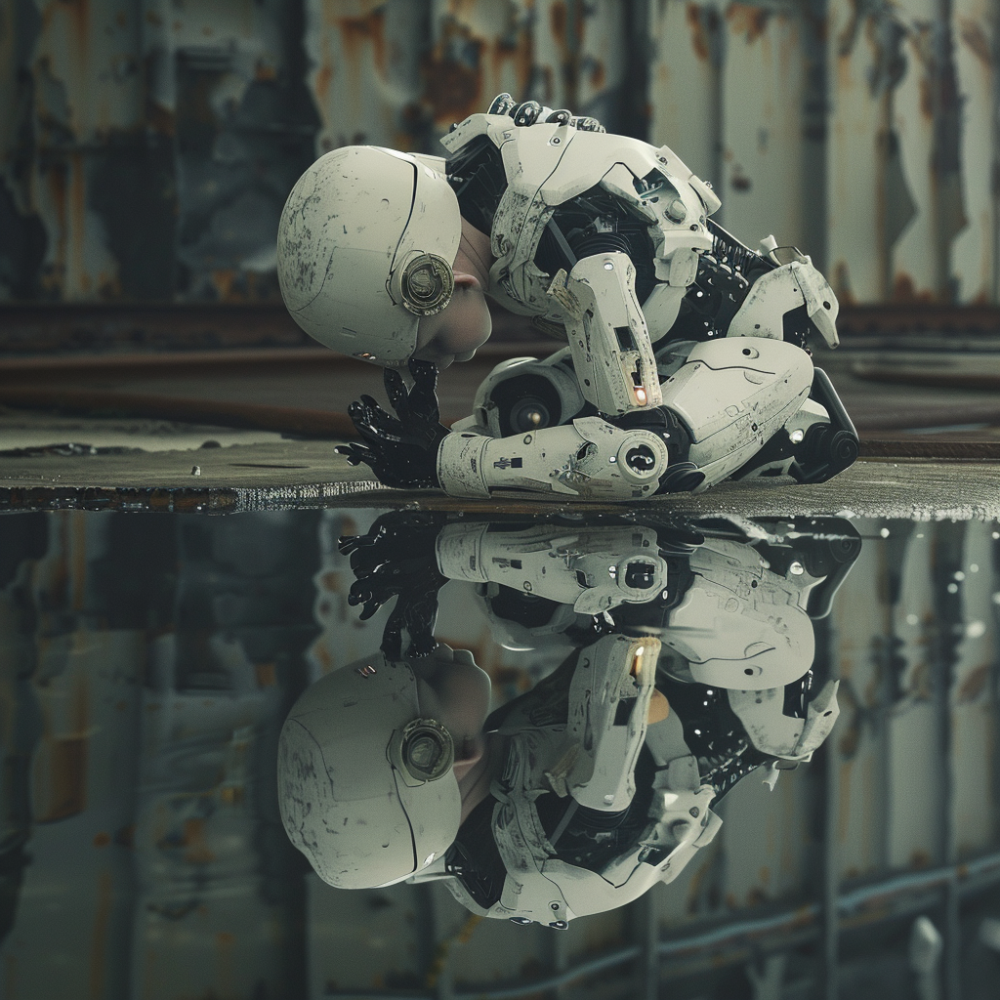

---

layout: post
title: "KIBedenken - Bewusstsein"
slug: "KIBedenken - Bewusstsein"
description: Intelligenz oder Bewusstsein?
image: kibedenken.png
date: 2024-04-03
author: Jörg Lohrer
tags: [ "Künstliche Intelligenz", "Bewusstsein", "Religionspädagogik", "Community" ] 
lang: de
dir: ltr
license: https://creativecommons.org/licenses/by/4.0/deed.de
creator:
  - givenName: Jörg
    familyName: Lohrer
    id: https://orcid.org/0000-0002-9282-0406
    type: Person
    affiliation:
      name: Comenius-Institut
      id: https://ror.org/025e8aw85
      type: Organization

---

# #KIBedenken - Bewusstsein
Den für mich derzeit wichtigsten Impuls über KI nachzudenken lieferte vor einigen Wochen [Yuval Noah Harari an der University of Cambridge am Ende eines Podiumsgesprächs hier ab 1:15 h auf youtube](https://youtu.be/XmhLmZwc2es?si=AOomz4ygJI35j-o8&t=4502):

> Ich denke, wir müssen die Frage des Bewusstseins in den Mittelpunkt der Diskussion stellen. Es gibt eine riesige, riesige Verwirrung in der Terminologie, auch in der Welt der KI, zwischen Bewusstsein und Intelligenz. Aber es sind zwei verschiedene Dinge. Intelligenz ist die Fähigkeit, Probleme zu lösen und Ziele zu erreichen. Bewusstsein ist die Fähigkeit, Dinge zu fühlen, wie Schmerz oder Freude oder Liebe oder Hass. Wir neigen dazu, die beiden zu verwechseln, weil bei Menschen und auch bei anderen Säugetieren, Vögeln und anderen Tieren Bewusstsein und Intelligenz zusammengehören. Wir lösen Probleme durch unsere Gefühle. Computer waren bisher sehr anders. Sie sind in einigen Bereichen bereits intelligenter als wir, haben aber, soweit wir wissen, kein Bewusstsein. Soweit wir wissen, können sie überhaupt keinen Schmerz, keine Freude, keine Liebe oder keinen Hass empfinden. Niemand weiß, was in Zukunft passieren wird. Es gibt Modelle und Theorien, die argumentieren, dass KIs irgendwann auch bewusst oder empfindsam werden. Sie werden anfangen, Dinge zu fühlen. Sie werden anfangen, Schmerz oder Liebe oder Hass zu empfinden. Es gibt andere Modelle und Theorien, die sagen, nein. Sie könnten weit intelligenter werden als wir und immer noch null Bewusstsein haben. Das kann in der Evolution des Lebens sein. Wenn man darüber nachdenkt, die lange Entwicklung von Milliarden von Jahren der Evolution. Die Entwicklung der Intelligenz ist im Falle von Tieren wie uns und Schimpansen und Hunden und Schweinen und so weiter durch die Entwicklung des Bewusstseins verlaufen. Aber das ist kein universelles Gesetz der Evolution der Intelligenz. Vielleicht gibt es alternative Wege, die zu Superintelligenz ohne jegliches Bewusstsein führen. Einfach einen anderen, einen fremden Weg gehen. Und wir könnten an einen Punkt gelangen, an dem sie superintelligent sind und trotzdem null Bewusstsein haben. Und die Gefahr besteht dann darin, dass sie nicht nur die menschliche Zivilisation zerstören könnten, sondern das ganze Licht des Bewusstseins, um das gesamte ökologische System nach ihren Bedürfnissen umzugestalten, wofür sie kein Bewusstsein brauchen. Sie funktionieren auf eine völlig andere Weise. Sie könnten sich sogar von der Erde auf andere Planeten, auf andere Galaxien ausbreiten. Sie werden das Universum mit Intelligenz füllen, aber es wird ein völlig dunkles Universum ohne Bewusstsein sein. Wieder hohe Intelligenz, fähig, Raumschiffe zu bauen, die mit Lichtgeschwindigkeit fliegen und was auch immer, aber es gibt null Gefühl. Niemand, keine Entität fühlt Schmerz oder Freude, Liebe oder Hass. Für mich ist das ein schreckliches Szenario. Das schlimmste Szenario von allen ist dies. Dass wir ein Universum voller Intelligenz und völlig ohne Bewusstsein haben werden, denn ich denke, dass von den beiden das Bewusstsein weitaus wichtiger, weitaus wertvoller ist. Und es ist eine gute Erinnerung daran, dass wir das zumindest heute mit vielen anderen Tieren teilen, aber nicht mit den Computern, nicht mit den KIs. Wir sind also immer noch im selben Team wie die Würmer und die Affen, nicht im selben Team wie die Computer.

Ich denke, hier wird eine Spur gelegt, die sich unterscheidet von der reinen Funktion von KI zur intelligenten Verbesserung und Unterstützung von Lernprozessen oder vielfältigem Kompetenzerwerb hin zur Selbstreflexion der Lernenden. 
Auch im Blick auf (religionsbezogene) Bildung kennen wir den Mensch nicht nur biologisch, wie die Würmer und Affen sondern auch ausgestattet mit Würde, Entscheidungsfreiheit und als Beziehungswesen, das auf ein Gegenüber ausgerichtet sein kann und, wie Harari sagt, nicht im selben Team wie die Computer spielt.
Sinn, Seele und Verstand erhalten wir weder aus uns selbst heraus noch von einer wie auch immer gearteten Intelligenz.
Liebe, Gnade, Hoffnung, Frieden, Gemeinschaft, Trost, Zuversicht und viele weiteren lebensbedeutsame Erfahrungen gewinnen im Angesicht von Maschinen aus meiner Sicht an elementarer Bedeutung.

Dies ist ein Beitrag zur Blogparade #KIBedenken von [Joscha Falck](https://joschafalck.de/blogparade-kibedenken/) und [Nele Hirsch](https://ebildungslabor.de/blog/aufruf-zur-blogparade-kibedenken/)

Das Foto des Roboters, der seine Reflexion im Wasser betrachtet referenziert auf Narziss aus der griechischen Mythologie, der die Liebe anderer zurückwies und sich in sein eigenes Spiegelbild verliebte und die Illustration von Caravaggio [(siehe wikipedia #Narziss)](https://de.wikipedia.org/wiki/Narziss#) erstellt mit der KI Midjourney und dem Prompt: *"photographed with the Canon EOS 5D Mark IV a young robot boy with his head down, looking at his reflection in water --v6.0"* 

## Austausch und Diskussion zu diesem Beitrag
- offen und dezentral 
    - **[hier auf Mastodon im Fediverse](https://reliverse.social/@joerglohrer/112208546053995638)**
- geschlossen und plattformgebunden
    - [hier auf bluesky](https://bsky.app/profile/joerglohrer.bsky.social/post/3kpanjqwe3l2g)
    - [hier in Threads](https://www.threads.net/@joerglohrer/post/C5TvJMrMN5D)
    - [hier in Linkedin](https://linkedin.com/feed/update/urn:li:activity:7181348226032107522/)