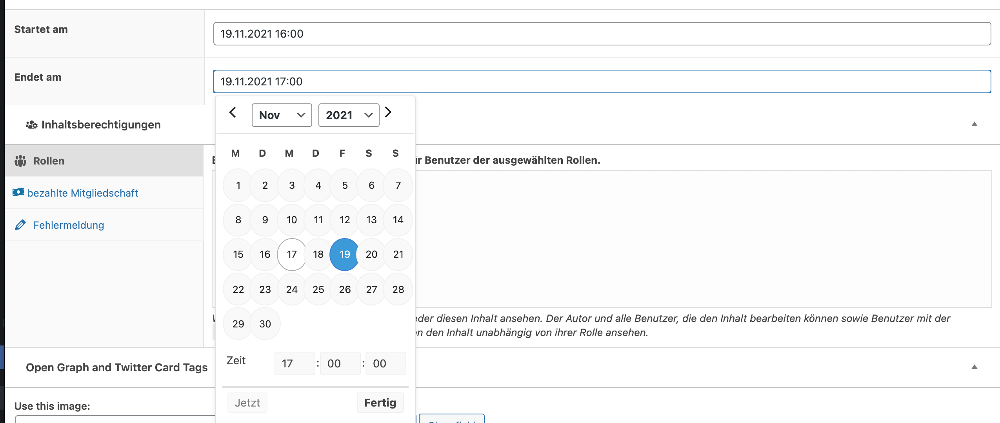
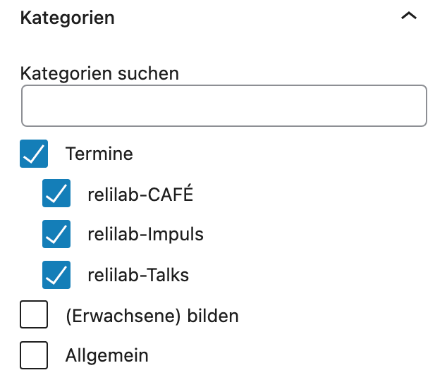
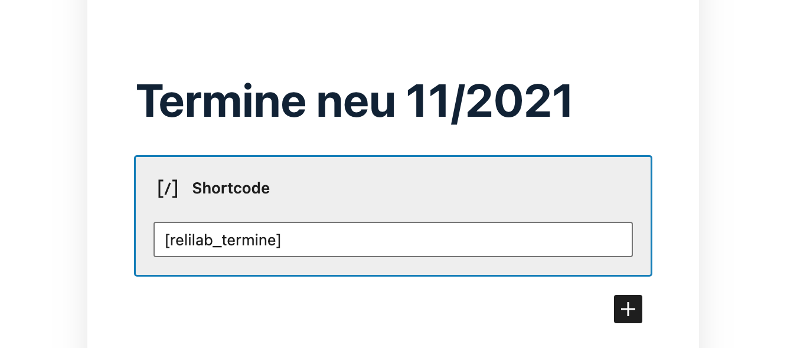
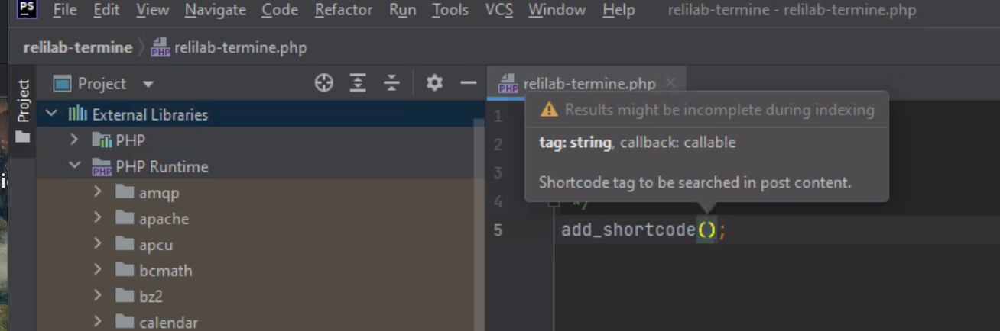
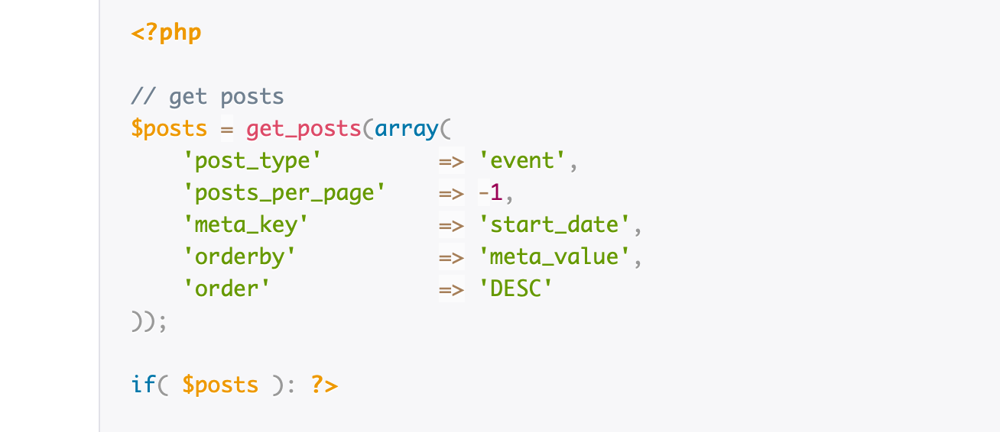
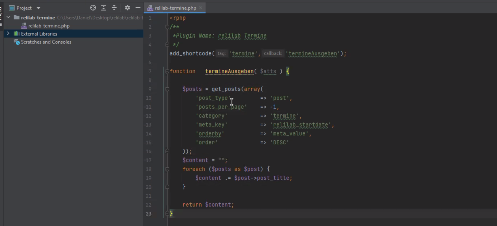

# WordPress Werkstatt PHP 
Zunächst wird auf relilab.org das kostenfreie [Plugin ACF - Advanced Custom Fields](https://de.wordpress.org/plugins/advanced-custom-fields/) installiert und aktiviert.
Dies ermöglicht weitere individuelle Beitragsfelder für die Beiträge.
Nun kann manuell aktiviert oder eine Feldgruppe importiert werden - hier mittels [dieser JSON-Datei](#ACF-JSON-Export), die das abkürzt:

mit dem Ergebnis, dass unter allen WordPress-Beiträgen jetzt zwei Terminfelder erscheinen, die ausgefüllt werden können:

Zudem gibt es neu eine Kategorie "Termine", die aktiviert werden kann mit Unterkategorien, die später Übersichtsseiten ermöglichen:

Jetzt wird das [Plugin relilab-termine](https://github.com/rpi-virtuell/relilab-termine) installiert und aktiviert
Nun kann mittels Shortcode ```[relilab_termine]``` eine Terminübersicht als WordPress-Block erzeugt werden:



## JSON
#### ACF-JSON-Export:
```json=
[
    {
        "key": "group_6193936e4f12c",
        "title": "Termin",
        "fields": [
            {
                "key": "field_619393f8e62e0",
                "label": "Startet am",
                "name": "relilab_startdate",
                "type": "date_time_picker",
                "instructions": "",
                "required": 0,
                "conditional_logic": 0,
                "wrapper": {
                    "width": "",
                    "class": "",
                    "id": ""
                },
                "display_format": "d.m.Y H:i",
                "return_format": "Y-m-d H:i",
                "first_day": 1
            },
            {
                "key": "field_619394a3e62e1",
                "label": "Endet am",
                "name": "relilab_enddate",
                "type": "date_time_picker",
                "instructions": "",
                "required": 0,
                "conditional_logic": 0,
                "wrapper": {
                    "width": "",
                    "class": "",
                    "id": ""
                },
                "display_format": "d.m.Y H:i",
                "return_format": "Y-m-d H:i",
                "first_day": 1
            }
        ],
        "location": [
            [
                {
                    "param": "post_type",
                    "operator": "==",
                    "value": "post"
                }
            ]
        ],
        "menu_order": 0,
        "position": "normal",
        "style": "default",
        "label_placement": "left",
        "instruction_placement": "label",
        "hide_on_screen": "",
        "active": true,
        "description": "",
        "show_in_rest": 0,
        "acfe_display_title": "",
        "acfe_autosync": "",
        "acfe_form": 0,
        "acfe_meta": "",
        "acfe_note": ""
    }
]

```

## PHP
### Software
#### PHP-Storm
[https://www.jetbrains.com/de-de/phpstorm/](https://www.jetbrains.com/de-de/phpstorm/)


##### Shortcode zum Sprechen bringen
[https://developer.wordpress.org/reference/functions/add_shortcode/](https://developer.wordpress.org/reference/functions/add_shortcode/)
In PhpStorm

```add_shortcode( string $tag, callable $callback )```

alle Termine listen, die 
[https://www.advancedcustomfields.com/resources/orde-posts-by-custom-fields/](https://www.advancedcustomfields.com/resources/orde-posts-by-custom-fields/)




PHP-Storm nutzt als External Library dann WordPress


### Plugin

Unsere Funktion:
```
/**
*Plugin Name: relilab Termine
*/
add_shortcode('termine','termineAusgeben');

function   termineAusgeben( $atts ) {

$posts = get_posts(array(
    'post_type'			=> 'post',
    'posts_per_page'	=> -1,
    'category'          => 'termine',
    'meta_key'			=> 'relilab_startdate',
    'orderby'			=> 'meta_value',
    'order'				=> 'DESC'
));


// ob_start();
global $post;
?>
<ul>
<?php
foreach ($posts as $post) {
setup_postdata( $post )
?>
<li>
<a href="<?php the_permalink(); ?>"><?php the_title(); ?> (date: <?php the_field('relilab_startdate'); ?>)</a>
</li>
<?php
}
?>

    </ul>
<?php
wp_reset_postdata();


//  return ob_get_clean();
}
```
